# SQL_Fun

From the LinkedIn Learning Course "SQL Essential Training"

## Objective: Learn a new SQL tool (SQLiteStudio) and further familiarize myself with essential SQLite functions.

## Skills Covered:
* How DataBases are organized
* Selecting rows and columns
* Creating new tables
* Inserting and updating data
* Sorting and filtering
* Accessing related tables with JOIN
* Working with strings
* Understanding numeric types
* Using aggregate functions and transactions
* Automating data with triggers
* Creating views
* Using CRUD functions

## Fundamental Concepts:
* CREATE TABLE
* INSERT INTO
* DROP TABLE / DROP TABLE IF EXISTS
* ID
* NULL
* SELECT
* DELETE
* Constraints: UNIQUE
* ALTER TABLE
* WHERE, LIKE, IN
* SELECT DISTINCT
* ORDER BY
* CASE WHEN

> 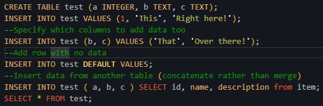

> 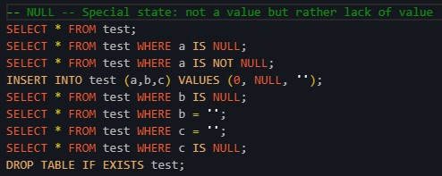

> 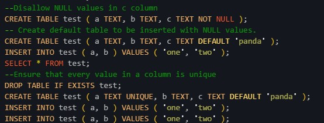

> 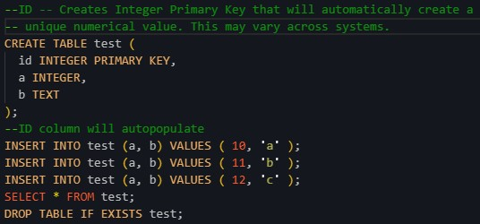

> 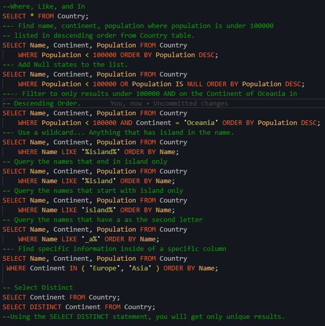

> 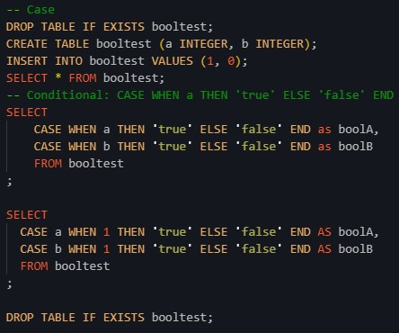

### String Functions:

* SINGLE QUOTES
* CONCATENATION

> 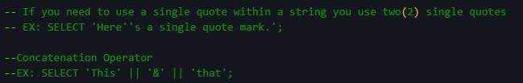

* LENGTH

> 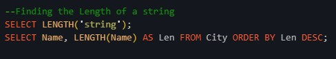

* SUBSTR

> 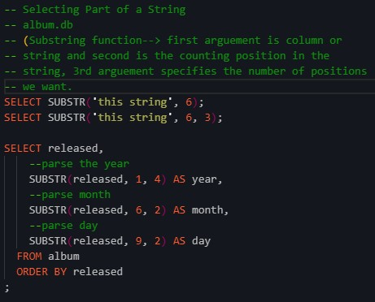

* TRIM

> 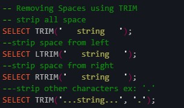

* UPPER/LOWER

> 

### Numeric Types:

> 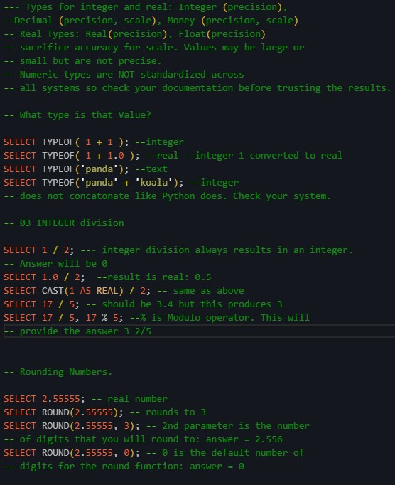

### DATE/TIME:

> 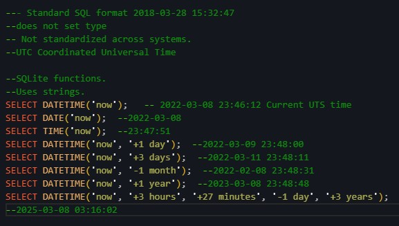

### Aggregations:
* HAVING clause opperates on aggregated data 
* WHERE is used before a GROUP BY, HAVING is used after GROUP BY and before ORDER BY
* AGGREGATE functions include but are not limited to: COUNT, AVG, MIN, MAX, SUM. 

> 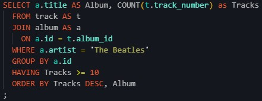

### Transactions:

* Transactions are a group of operations that are handled as one unit of work. They improve performance. 
* Transactions can add information to one table and remove the same information from another table at the same time.

> 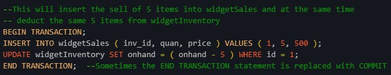

* ROLLBACK is used to undo a transaction before it is completed in the event of an error. 

> 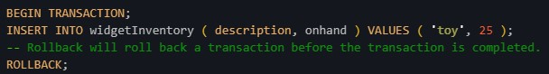

* This insert statement adding 1000 lines to a table required 2.024 seconds to run without transaction. With transaction it required 0.036 seconds. 

> 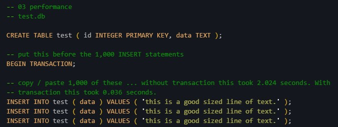

## Triggers

* Triggers are operations that are automatically performed when a specified database event occurs. 

> 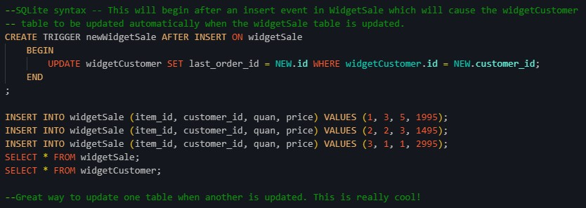

* Triggers can also be used to prevent unwanted updates. 

> 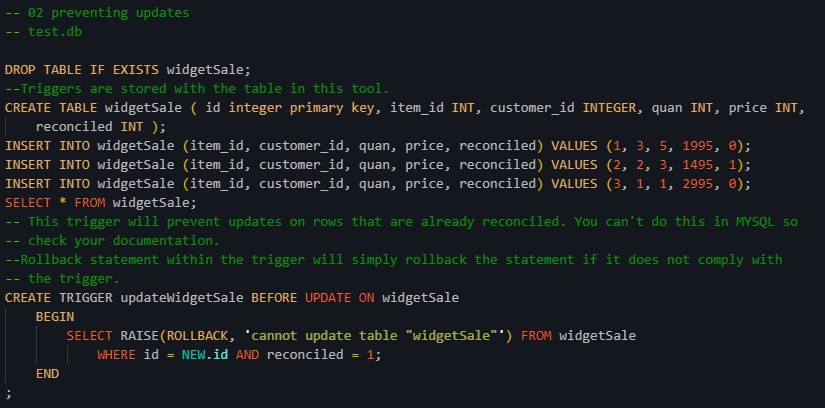

* They can be used to add a timestamp when tables are updated.

> 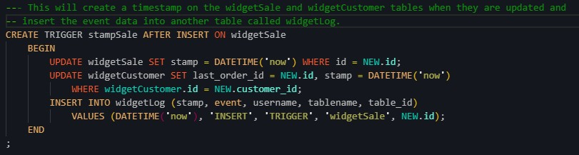

## Subselects / Nested Queries

> 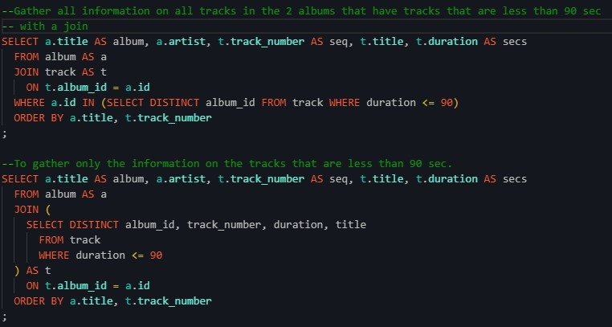

## Views:

* Views are used to create a copy with the intent of data manipulation and exploration. 

> 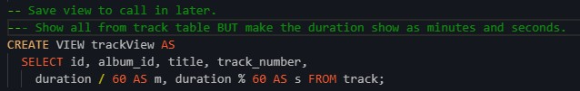

## And one last nifty thing to remember when dealing with times. 

> 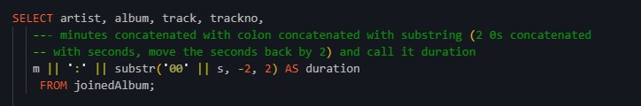

